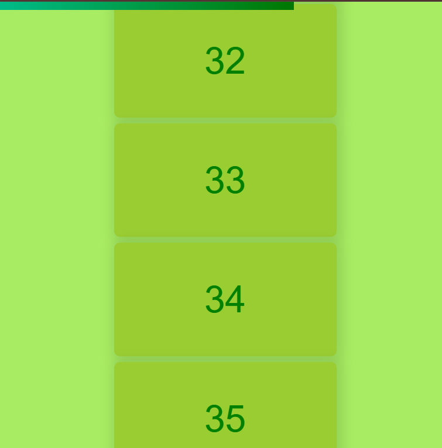

# Scrollbar Animation

A simple project built with HTML, CSS, and JavaScript that visually indicates how much of the page the user has scrolled.

## 📸 Screenshot

## 🌍 Live Demo

[🔗 View Project on Netlify](https://scrollbaranimation.netlify.app/)

## 👩‍💻 Author

**Nishu Singh**  
Practicing JavaScript and DOM manipulation by building small projects 💪
